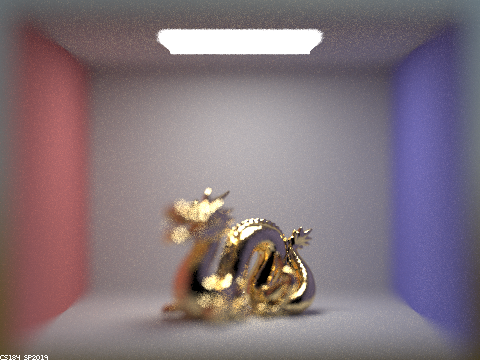

# PathTracer2
Continue from PathTracer1, add more complicated materials, environment lights, and depth of field to ray tracer. 

 

## Part 1: Ray Generation and Intersection

### Reflection and refraction

With sample rate of 256， 4 samples per light and max depth of 4.

## Part 2: Microfacet Material

With sample rate of 256， 4 samples per light and max depth of 7.

## Part 3: Environment Light

Importance sampling is introduced to increase the density of sample points in the regions that we are interested in. 

  

## Part 4: Depth of Field

Change aperture and focal distance to control the depth of field.

  
